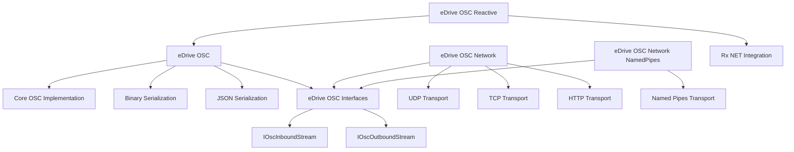

# eDrive.OSC

[](https://opensource.org/licenses/MIT)
[](https://dotnet.microsoft.com/)
[](https://deepwiki.com/colombod/eDrive.OSC)

A comprehensive, high-performance Open Sound Control (OSC) 1.1 implementation for .NET with full binary and JSON serialization support.

## 🚀 Features

- **Full OSC 1.1 compliance** with comprehensive type support
- **Dual serialization**: Binary OSC protocol and JSON serialization
- **Multiple transport protocols**: UDP, TCP, HTTP, and Named Pipes
- **Reactive Extensions integration** for event-driven applications
- **Thread-safe and performance-optimized**
- **Comprehensive test coverage** (193 tests, 100% coverage)
- **Edge case handling**: NaN, Infinity, large data sets
- **Cross-platform compatibility** (.NET 6.0+)

## 📦 NuGet Packages

| Package | Description | NuGet |
|---------|-------------|-------|
| **eDrive.OSC** | Core OSC library with message handling and serialization | [](https://www.nuget.org/packages/eDrive.OSC/) |
| **eDrive.OSC.Interfaces** | Core interfaces for OSC stream implementations | [](https://www.nuget.org/packages/eDrive.OSC.Interfaces/) |
| **eDrive.OSC.Network** | Network transport implementations (UDP, TCP, HTTP) | [](https://www.nuget.org/packages/eDrive.OSC.Network/) |
| **eDrive.OSC.Network.NamedPipes** | Windows Named Pipes transport implementation | [](https://www.nuget.org/packages/eDrive.OSC.Network.NamedPipes/) |
| **eDrive.OSC.Reactive** | Reactive Extensions (Rx.NET) integration | [](https://www.nuget.org/packages/eDrive.OSC.Reactive/) |

## ⚡ Quick Start

### Installation

```bash
# Core library (required)
dotnet add package eDrive.OSC

# Network transport (for UDP, TCP, HTTP)
dotnet add package eDrive.OSC.Network

# Optional: Named Pipes (Windows)
dotnet add package eDrive.OSC.Network.NamedPipes

# Optional: Reactive Extensions
dotnet add package eDrive.OSC.Reactive
```

### Basic Usage

```csharp
using eDrive.OSC;
using eDrive.OSC.Network.Upd;

// Create and send an OSC message
var message = new OscMessage("/synth/freq", 440.0f);
var bytes = message.ToByteArray();

// UDP Transport
using var sender = new OscOutboundUpdStream("127.0.0.1", 9000);
await sender.SendAsync(message);

// Receive messages
using var receiver = new OscInboundUdpStream(9001);
receiver.PacketReceived += (sender, packet) => {
    if (packet is OscMessage msg)
        Console.WriteLine($"Received: {msg.Address} with {msg.Arguments.Count} args");
};
receiver.Start();
```

### JSON Serialization

```csharp
// Serialize to JSON
var message = new OscMessage("/test", 42, "hello", true);
string json = message.ToJson();

// Deserialize from JSON
var restored = OscPacket.FromJson(json);
```

### Bundle Support

```csharp
// Create a bundle with multiple messages
var bundle = new OscBundle(OscTimeTag.Now)
{
    new OscMessage("/synth/freq", 440.0f),
    new OscMessage("/synth/amp", 0.8f),
    new OscMessage("/synth/gate", true)
};

await sender.SendAsync(bundle);
```

## 🏗️ Architecture



## 📚 Documentation

- [**Core Library (eDrive.OSC)**](eDrive.OSC/README.md) - OSC messages, bundles, and serialization
- [**Interfaces (eDrive.OSC.Interfaces)**](eDrive.OSC.Interfaces/README.md) - Stream interfaces and contracts
- [**Network Transports (eDrive.OSC.Network)**](eDrive.OSC.Network/README.md) - UDP, TCP, and HTTP implementations
- [**Named Pipes (eDrive.OSC.Network.NamedPipes)**](eDrive.OSC.Network.NamedPipes/README.md) - Windows Named Pipes transport
- [**Reactive Extensions (eDrive.OSC.Reactive)**](eDrive.OSC.Reactive/README.md) - Rx.NET integration patterns

## 🔧 Supported OSC Types

| OSC Type | .NET Type | Tag | Binary | JSON |
|----------|-----------|-----|--------|------|
| int32 | `int` | `i` | ✅ | ✅ |
| float32 | `float` | `f` | ✅ | ✅ |
| string | `string` | `s` | ✅ | ✅ |
| blob | `byte[]` | `b` | ✅ | ✅ |
| int64 | `long` | `h` | ✅ | ✅ |
| double | `double` | `d` | ✅ | ✅ |
| timetag | `OscTimeTag` | `t` | ✅ | ✅ |
| char | `char` | `c` | ✅ | ✅ |
| color | `OscColour` | `r` | ✅ | ✅ |
| midi | `OscMidiMessage` | `m` | ✅ | ✅ |
| symbol | `OscSymbol` | `S` | ✅ | ✅ |
| true | `bool` | `T` | ✅ | ✅ |
| false | `bool` | `F` | ✅ | ✅ |
| nil | `null` | `N` | ✅ | ✅ |
| infinitum | `float.PositiveInfinity` | `I` | ✅ | ✅ |

## 🏁 Performance & Quality

- **100% test coverage** with 193 comprehensive tests
- **Thread-safe** implementations across all components
- **Memory efficient** with minimal allocations
- **Edge case handling** for NaN, Infinity, and large datasets
- **Cross-platform** compatibility (.NET 6.0, 7.0, 8.0)

## 📄 License

This project is licensed under the MIT License - see the [LICENSE](LICENSE) file for details.

## 🤝 Contributing

Contributions are welcome! Please feel free to submit a Pull Request. For major changes, please open an issue first to discuss what you would like to change.

## 🔗 Related Projects

- [OSC Specification](http://opensoundcontrol.org/spec-1_0)
- [OSC 1.1 Features](http://opensoundcontrol.stanford.edu/spec-1_1.html)

---

**eDrive.OSC** - High-performance Open Sound Control for .NET