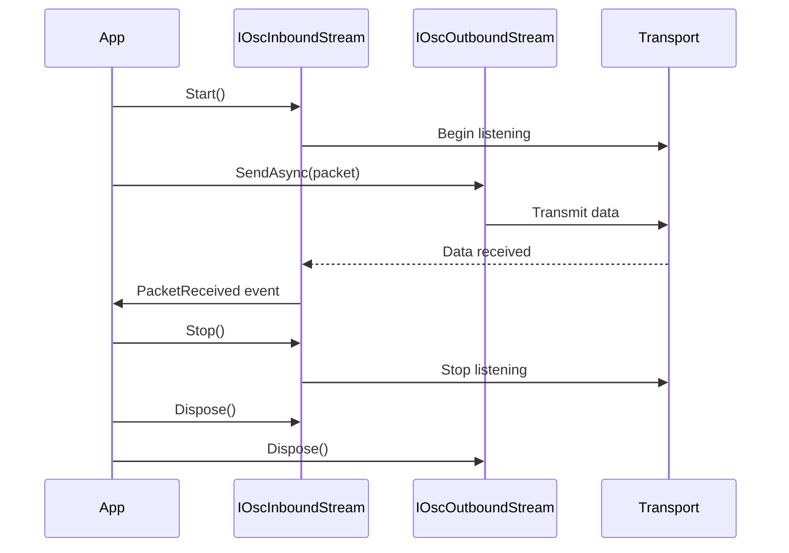

# eDrive.OSC.Interfaces

[](https://www.nuget.org/packages/eDrive.OSC.Interfaces/)
[](https://opensource.org/licenses/MIT)

Core interfaces for OSC stream implementations providing contracts for inbound and outbound OSC data streams. This package defines the fundamental abstractions used across all eDrive.OSC transport implementations.

## 🎯 Purpose

This package provides the essential interfaces that enable:

- **Transport abstraction**: Write code that works with any transport (UDP, TCP, HTTP, Named Pipes)
- **Dependency injection**: Use interfaces for better testability and modularity
- **Custom implementations**: Create your own transport layers following standard contracts
- **Library integration**: Build OSC-aware applications without coupling to specific transports

## 📦 Installation

```bash
dotnet add package eDrive.OSC.Interfaces
```

**Note**: This is typically installed automatically as a dependency of transport packages.

## 🏗️ Core Interfaces

### IOscInboundStream

Defines the contract for receiving OSC packets from any transport layer:

```csharp
using eDrive.OSC.Interfaces;

public interface IOscInboundStream : IDisposable
{
    /// <summary>
    /// Event fired when an OSC packet is received
    /// </summary>
    event EventHandler<OscPacket> PacketReceived;

    /// <summary>
    /// Gets the local endpoint this stream is bound to
    /// </summary>
    EndPoint LocalEndPoint { get; }

    /// <summary>
    /// Gets a value indicating whether the stream is currently listening
    /// </summary>
    bool IsListening { get; }

    /// <summary>
    /// Start listening for OSC packets
    /// </summary>
    void Start();

    /// <summary>
    /// Stop listening for OSC packets
    /// </summary>
    void Stop();
}
```

### IOscOutboundStream

Defines the contract for sending OSC packets through any transport layer:

```csharp
using eDrive.OSC.Interfaces;

public interface IOscOutboundStream : IDisposable
{
    /// <summary>
    /// Gets the remote endpoint this stream sends to
    /// </summary>
    EndPoint RemoteEndPoint { get; }

    /// <summary>
    /// Send an OSC packet asynchronously
    /// </summary>
    Task SendAsync(OscPacket packet);

    /// <summary>
    /// Send an OSC packet synchronously
    /// </summary>
    void Send(OscPacket packet);

    /// <summary>
    /// Send raw bytes asynchronously
    /// </summary>
    Task SendAsync(byte[] data);

    /// <summary>
    /// Send raw bytes synchronously
    /// </summary>
    void Send(byte[] data);
}
```

## 💡 Usage Patterns

### Transport-Agnostic Code

Write code that works with any transport implementation:

```csharp
using eDrive.OSC;
using eDrive.OSC.Interfaces;

public class OscController
{
    private readonly IOscOutboundStream _sender;
    private readonly IOscInboundStream _receiver;

    public OscController(IOscOutboundStream sender, IOscInboundStream receiver)
    {
        _sender = sender;
        _receiver = receiver;
        
        // Subscribe to incoming messages
        _receiver.PacketReceived += OnPacketReceived;
        _receiver.Start();
    }

    public async Task SendParameterAsync(string address, object value)
    {
        var message = new OscMessage(address, value);
        await _sender.SendAsync(message);
    }

    private void OnPacketReceived(object sender, OscPacket packet)
    {
        if (packet is OscMessage message)
        {
            Console.WriteLine($"Received: {message.Address}");
        }
    }

    public void Dispose()
    {
        _receiver?.Dispose();
        _sender?.Dispose();
    }
}
```

### Dependency Injection

Register interfaces with your DI container:

```csharp
using Microsoft.Extensions.DependencyInjection;
using eDrive.OSC.Network.Upd;

public class Startup
{
    public void ConfigureServices(IServiceCollection services)
    {
        // Register transport implementations
        services.AddSingleton<IOscOutboundStream>(provider =>
            new OscOutboundUpdStream("127.0.0.1", 9000));
            
        services.AddSingleton<IOscInboundStream>(provider =>
            new OscInboundUdpStream(9001));

        // Register your OSC services
        services.AddScoped<OscController>();
    }
}

// Usage in controller/service
public class MyService
{
    public MyService(IOscOutboundStream sender)
    {
        // Automatically gets the configured transport
    }
}
```

### Factory Pattern

Create transport factories for different scenarios:

```csharp
using eDrive.OSC.Interfaces;
using eDrive.OSC.Network.Upd;
using eDrive.OSC.Network.Tcp;

public interface IOscStreamFactory
{
    IOscOutboundStream CreateSender(string protocol, string host, int port);
    IOscInboundStream CreateReceiver(string protocol, int port);
}

public class OscStreamFactory : IOscStreamFactory
{
    public IOscOutboundStream CreateSender(string protocol, string host, int port)
    {
        return protocol.ToLower() switch
        {
            "udp" => new OscOutboundUpdStream(host, port),
            "tcp" => new OscOutboundTcpStream(host, port),
            _ => throw new ArgumentException($"Unknown protocol: {protocol}")
        };
    }

    public IOscInboundStream CreateReceiver(string protocol, int port)
    {
        return protocol.ToLower() switch
        {
            "udp" => new OscInboundUdpStream(port),
            "tcp" => new OscInboundTcpStream(port),
            _ => throw new ArgumentException($"Unknown protocol: {protocol}")
        };
    }
}
```

### Custom Implementation

Create your own transport implementation:

```csharp
using eDrive.OSC;
using eDrive.OSC.Interfaces;

public class CustomOscInboundStream : IOscInboundStream
{
    public event EventHandler<OscPacket> PacketReceived;
    public EndPoint LocalEndPoint { get; private set; }
    public bool IsListening { get; private set; }

    public void Start()
    {
        IsListening = true;
        // Start your custom transport logic
        StartCustomTransport();
    }

    public void Stop()
    {
        IsListening = false;
        // Stop your custom transport logic
        StopCustomTransport();
    }

    private void StartCustomTransport()
    {
        // Your transport implementation
        // When data arrives, parse and raise event:
        // var packet = OscPacket.Parse(receivedBytes);
        // PacketReceived?.Invoke(this, packet);
    }

    private void StopCustomTransport()
    {
        // Cleanup resources
    }

    public void Dispose()
    {
        Stop();
        // Dispose resources
    }
}
```

## 🔄 Stream Lifecycle



## 🧩 Available Implementations

The following packages provide implementations of these interfaces:

| Package | Transports | Platform |
|---------|------------|----------|
| [**eDrive.OSC.Network**](../eDrive.OSC.Network/README.md) | UDP, TCP, HTTP | Cross-platform |
| [**eDrive.OSC.Network.NamedPipes**](../eDrive.OSC.Network.NamedPipes/README.md) | Named Pipes | Windows |

## 🎛️ Interface Benefits

### Testability

Mock interfaces for unit testing:

```csharp
using Moq;
using eDrive.OSC.Interfaces;

[Test]
public async Task SendParameterTest()
{
    // Arrange
    var mockSender = new Mock<IOscOutboundStream>();
    var controller = new OscController(mockSender.Object, null);

    // Act
    await controller.SendParameterAsync("/test", 42);

    // Assert
    mockSender.Verify(s => s.SendAsync(It.IsAny<OscMessage>()), Times.Once);
}
```

### Configuration Flexibility

Switch transports without code changes:

```csharp
// appsettings.json
{
  "OscTransport": {
    "Type": "UDP",
    "Host": "127.0.0.1",
    "Port": 9000
  }
}

// Configuration-driven transport selection
var config = Configuration.GetSection("OscTransport");
IOscOutboundStream transport = config["Type"] switch
{
    "UDP" => new OscOutboundUpdStream(config["Host"], int.Parse(config["Port"])),
    "TCP" => new OscOutboundTcpStream(config["Host"], int.Parse(config["Port"])),
    _ => throw new InvalidOperationException("Unknown transport type")
};
```

## 🔗 Related Packages

- [**eDrive.OSC**](../eDrive.OSC/README.md) - Core OSC implementation
- [**eDrive.OSC.Network**](../eDrive.OSC.Network/README.md) - Network transport implementations
- [**eDrive.OSC.Reactive**](../eDrive.OSC.Reactive/README.md) - Reactive Extensions integration

---

**eDrive.OSC.Interfaces** - Building blocks for OSC transport abstraction