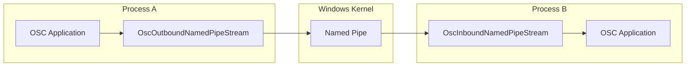
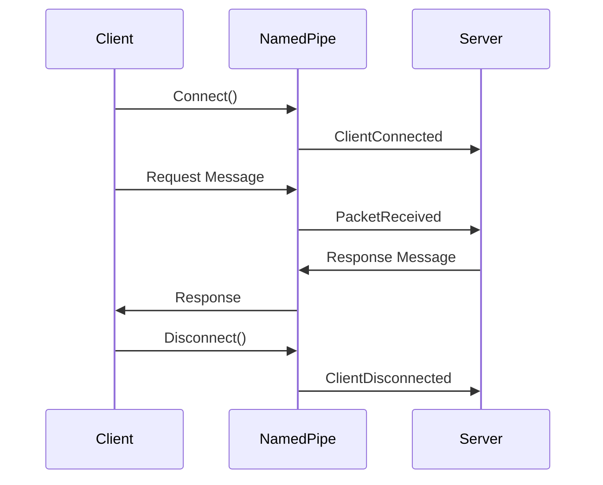

# eDrive.OSC.Network.NamedPipes

[](https://www.nuget.org/packages/eDrive.OSC.Network.NamedPipes/)
[](https://opensource.org/licenses/MIT)
[](https://deepwiki.com/colombod/eDrive.OSC)

Windows Named Pipes transport implementation for OSC communication. Provides high-performance, local inter-process communication (IPC) capabilities for OSC applications running on the same Windows machine.

## 🎯 Features

- **Windows Named Pipes** - Fast, secure IPC for Windows applications
- **High Performance** - Lower latency than TCP/UDP for local communication
- **Security Integration** - Windows security and access control support
- **Process Isolation** - Secure communication between applications
- **Duplex Communication** - Full bidirectional message flow
- **Easy Integration** - Implements standard [`IOscInboundStream`](../eDrive.OSC.Interfaces/README.md) and [`IOscOutboundStream`](../eDrive.OSC.Interfaces/README.md) interfaces

## 📦 Installation

```bash
dotnet add package eDrive.OSC.Network.NamedPipes
```

**Platform Requirements**: Windows (.NET Framework 4.6.1+ or .NET Core 2.0+)

## 🚀 Quick Start

### Basic Usage

```csharp
using eDrive.OSC;
using eDrive.OSC.Network.NamedPipes;

// Create a named pipe server (receiver)
using var server = new OscInboundNamedPipeStream("MyOscPipe");
server.PacketReceived += (s, packet) => {
    if (packet is OscMessage msg)
        Console.WriteLine($"Received: {msg.Address}");
};
server.Start();

// Create a named pipe client (sender)
using var client = new OscOutboundNamedPipeStream("MyOscPipe");
await client.ConnectAsync();
await client.SendAsync(new OscMessage("/synth/freq", 440.0f));
```

### Advanced Configuration

```csharp
// Server with custom configuration
var server = new OscInboundNamedPipeStream("MyOscPipe")
{
    MaxConnectedClients = 10,           // Allow up to 10 concurrent clients
    BufferSize = 64 * 1024,             // 64KB buffer
    AllowCurrentUserOnly = true,        // Security: current user only
    InBufferSize = 32 * 1024,           // Input buffer size
    OutBufferSize = 32 * 1024           // Output buffer size
};

// Client with timeout and retry logic
var client = new OscOutboundNamedPipeStream("MyOscPipe")
{
    ConnectTimeout = TimeSpan.FromSeconds(5),
    AutoReconnect = true,
    ReconnectInterval = TimeSpan.FromSeconds(1)
};
```

## 🏗️ Architecture

Named Pipes provide direct process-to-process communication on Windows:



## 🔧 Server Implementation

### Creating a Named Pipe Server

```csharp
using eDrive.OSC.Network.NamedPipes;

public class OscNamedPipeServer : IDisposable
{
    private readonly OscInboundNamedPipeStream _server;
    
    public OscNamedPipeServer(string pipeName)
    {
        _server = new OscInboundNamedPipeStream(pipeName);
        _server.PacketReceived += OnPacketReceived;
        _server.ClientConnected += OnClientConnected;
        _server.ClientDisconnected += OnClientDisconnected;
        _server.ErrorOccurred += OnErrorOccurred;
    }
    
    public void Start()
    {
        _server.Start();
        Console.WriteLine($"Named pipe server started: {_server.PipeName}");
    }
    
    private void OnPacketReceived(object sender, OscPacket packet)
    {
        Console.WriteLine($"Received packet from client");
        
        // Echo the message back to the client
        if (packet is OscMessage message)
        {
            var echo = new OscMessage("/echo" + message.Address, message.Arguments.ToArray());
            _server.SendToClient(echo);
        }
    }
    
    private void OnClientConnected(object sender, EventArgs e)
    {
        Console.WriteLine("Client connected");
    }
    
    private void OnClientDisconnected(object sender, EventArgs e)
    {
        Console.WriteLine("Client disconnected");
    }
    
    private void OnErrorOccurred(object sender, Exception error)
    {
        Console.WriteLine($"Server error: {error.Message}");
    }
    
    public void Dispose() => _server?.Dispose();
}
```

## 🔌 Client Implementation

### Creating a Named Pipe Client

```csharp
public class OscNamedPipeClient : IDisposable
{
    private readonly OscOutboundNamedPipeStream _client;
    private readonly Timer _heartbeatTimer;
    
    public bool IsConnected => _client.IsConnected;
    
    public OscNamedPipeClient(string pipeName)
    {
        _client = new OscOutboundNamedPipeStream(pipeName)
        {
            AutoReconnect = true,
            ReconnectInterval = TimeSpan.FromSeconds(2)
        };
        
        _client.Connected += OnConnected;
        _client.Disconnected += OnDisconnected;
        _client.ErrorOccurred += OnErrorOccurred;
        
        // Send heartbeat every 5 seconds
        _heartbeatTimer = new Timer(SendHeartbeat, null, 
            TimeSpan.FromSeconds(5), TimeSpan.FromSeconds(5));
    }
    
    public async Task ConnectAsync()
    {
        try
        {
            await _client.ConnectAsync();
        }
        catch (TimeoutException)
        {
            throw new InvalidOperationException("Failed to connect to named pipe server");
        }
    }
    
    public async Task SendParameterAsync(string address, params object[] args)
    {
        if (!_client.IsConnected)
        {
            throw new InvalidOperationException("Client is not connected");
        }
        
        var message = new OscMessage(address, args);
        await _client.SendAsync(message);
    }
    
    private void OnConnected(object sender, EventArgs e)
    {
        Console.WriteLine("Connected to named pipe server");
    }
    
    private void OnDisconnected(object sender, EventArgs e)
    {
        Console.WriteLine("Disconnected from named pipe server");
    }
    
    private void OnErrorOccurred(object sender, Exception error)
    {
        Console.WriteLine($"Client error: {error.Message}");
    }
    
    private async void SendHeartbeat(object state)
    {
        try
        {
            if (_client.IsConnected)
            {
                var heartbeat = new OscMessage("/heartbeat", DateTime.UtcNow.Ticks);
                await _client.SendAsync(heartbeat);
            }
        }
        catch (Exception ex)
        {
            Console.WriteLine($"Heartbeat failed: {ex.Message}");
        }
    }
    
    public void Dispose()
    {
        _heartbeatTimer?.Dispose();
        _client?.Dispose();
    }
}
```

## 🔄 Communication Patterns

### Request-Response Pattern



## 📊 Performance Characteristics

| Metric | Named Pipes | UDP | TCP |
|--------|-------------|-----|-----|
| **Latency** | ~50μs | ~100μs | ~200μs |
| **Throughput** | Very High | High | High |
| **CPU Overhead** | Low | Medium | Medium |
| **Memory Usage** | Low | Low | Medium |
| **Security** | Windows ACL | None | None |
| **Reliability** | High | Low | High |

## 🔒 Security Configuration

### Access Control

```csharp
// Restrict access to specific users/groups
var secureServer = new OscInboundNamedPipeStream("SecurePipe")
{
    AllowCurrentUserOnly = true,  // Only allow current user
    RequireAuthentication = true   // Require client authentication
};

// Custom security attributes
var customSecurity = new PipeSecurity();
customSecurity.AddAccessRule(new PipeAccessRule(
    WindowsIdentity.GetCurrent().User,
    PipeAccessRights.FullControl,
    AccessControlType.Allow));

var secureServerCustom = new OscInboundNamedPipeStream("CustomSecurePipe", customSecurity);
```

## 🧪 Testing & Debugging

### Unit Testing

```csharp
[Test]
public async Task NamedPipe_SendReceive_Success()
{
    const string pipeName = "TestPipe";
    var receivedPacket = (OscPacket)null;
    
    // Arrange
    using var server = new OscInboundNamedPipeStream(pipeName);
    server.PacketReceived += (s, p) => receivedPacket = p;
    server.Start();
    
    using var client = new OscOutboundNamedPipeStream(pipeName);
    await client.ConnectAsync();
    
    // Act
    var testMessage = new OscMessage("/test", 42);
    await client.SendAsync(testMessage);
    
    // Assert
    await Task.Delay(100); // Allow message to be processed
    Assert.IsNotNull(receivedPacket);
    Assert.IsInstanceOf<OscMessage>(receivedPacket);
    
    var received = (OscMessage)receivedPacket;
    Assert.AreEqual("/test", received.Address);
    Assert.AreEqual(42, received.Arguments[0]);
}
```

## 🔗 Integration Examples

### Windows Service Integration

```csharp
public class OscNamedPipeService : BackgroundService
{
    private readonly OscInboundNamedPipeStream _server;
    private readonly ILogger<OscNamedPipeService> _logger;
    
    public OscNamedPipeService(ILogger<OscNamedPipeService> logger)
    {
        _logger = logger;
        _server = new OscInboundNamedPipeStream("OscService");
        _server.PacketReceived += OnPacketReceived;
        _server.ErrorOccurred += OnError;
    }
    
    protected override async Task ExecuteAsync(CancellationToken stoppingToken)
    {
        _server.Start();
        _logger.LogInformation("OSC Named Pipe Service started");
        
        try
        {
            await Task.Delay(Timeout.Infinite, stoppingToken);
        }
        catch (OperationCanceledException)
        {
            _logger.LogInformation("OSC Named Pipe Service stopping");
        }
        finally
        {
            _server.Stop();
            _server.Dispose();
        }
    }
    
    private void OnPacketReceived(object sender, OscPacket packet)
    {
        _logger.LogDebug($"Received OSC packet: {packet}");
        // Process packet
    }
    
    private void OnError(object sender, Exception error)
    {
        _logger.LogError(error, "OSC Named Pipe error occurred");
    }
}
```

## ⚠️ Platform Considerations

### Windows Versions

| Windows Version | Named Pipes Support | Notes |
|-----------------|-------------------|-------|
| Windows 10/11 | Full Support | Recommended |
| Windows Server 2016+ | Full Support | Enterprise features |
| Windows 8.1 | Full Support | Legacy support |
| Windows 7 | Limited | Not recommended |

## 🔗 Related Packages

- [**eDrive.OSC**](../eDrive.OSC/README.md) - Core OSC implementation
- [**eDrive.OSC.Interfaces**](../eDrive.OSC.Interfaces/README.md) - Stream interfaces
- [**eDrive.OSC.Network**](../eDrive.OSC.Network/README.md) - Cross-platform network transports
- [**eDrive.OSC.Reactive**](../eDrive.OSC.Reactive/README.md) - Reactive Extensions integration

---

**eDrive.OSC.Network.NamedPipes** - High-performance Windows IPC for OSC