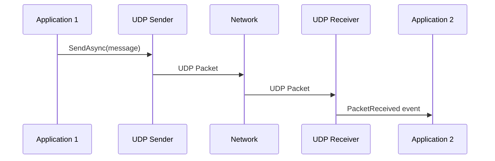
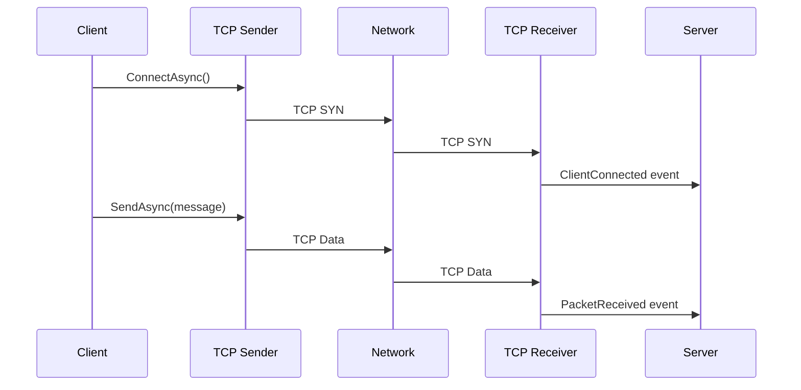

# eDrive.OSC.Network

[](https://www.nuget.org/packages/eDrive.OSC.Network/)
[](https://opensource.org/licenses/MIT)

Cross-platform network transport implementations for OSC communication supporting UDP, TCP, and HTTP protocols. This package provides production-ready, high-performance network streams for sending and receiving OSC packets.

## 🚀 Features

- **UDP Transport** - Fast, connectionless communication (most common for OSC)
- **TCP Transport** - Reliable, connection-oriented communication
- **HTTP Transport** - Web-friendly OSC over HTTP with JSON support
- **Cross-platform** - Works on Windows, macOS, and Linux
- **High performance** - Optimized for low latency and high throughput
- **Thread-safe** - Safe for concurrent access
- **Configurable** - Extensive configuration options for each transport

## 📦 Installation

```bash
dotnet add package eDrive.OSC.Network
```

## 🌐 Transport Types

### UDP Transport (Recommended)

UDP is the most commonly used transport for OSC, offering low latency and simplicity:

```csharp
using eDrive.OSC;
using eDrive.OSC.Network.Upd;

// Send OSC messages via UDP
using var sender = new OscOutboundUpdStream("127.0.0.1", 9000);
await sender.SendAsync(new OscMessage("/synth/freq", 440.0f));

// Receive OSC messages via UDP
using var receiver = new OscInboundUdpStream(9001);
receiver.PacketReceived += (s, packet) => {
    if (packet is OscMessage msg)
        Console.WriteLine($"Received: {msg.Address}");
};
receiver.Start();
```

#### UDP Configuration Options

```csharp
// Advanced UDP sender configuration
var sender = new OscOutboundUpdStream("192.168.1.100", 9000)
{
    MulticastTimeToLive = 32,  // For multicast
    DontFragment = true,       // Don't fragment packets
    Ttl = 64                   // Time to live
};

// UDP receiver with specific interface
var receiver = new OscInboundUdpStream(
    localPort: 9001,
    localAddress: IPAddress.Parse("192.168.1.50")  // Bind to specific interface
);

// Multicast receiver
var multicastReceiver = new OscInboundUdpStream(9002);
multicastReceiver.JoinMulticastGroup(IPAddress.Parse("224.0.0.1"));
```

### TCP Transport

TCP provides reliable, ordered delivery with connection management:

```csharp
using eDrive.OSC.Network.Tcp;

// TCP Sender (client)
using var tcpSender = new OscOutboundTcpStream("127.0.0.1", 9000);
await tcpSender.ConnectAsync();
await tcpSender.SendAsync(new OscMessage("/test", 42));

// TCP Receiver (server)
using var tcpReceiver = new OscInboundTcpStream(9001);
tcpReceiver.PacketReceived += (s, packet) => {
    Console.WriteLine($"TCP: {packet}");
};
tcpReceiver.ClientConnected += (s, client) => {
    Console.WriteLine($"Client connected: {client.RemoteEndPoint}");
};
tcpReceiver.Start();
```

#### TCP Connection Management

```csharp
// Connection events
tcpReceiver.ClientConnected += (sender, client) => {
    Console.WriteLine($"New client: {client.RemoteEndPoint}");
};

tcpReceiver.ClientDisconnected += (sender, client) => {
    Console.WriteLine($"Client disconnected: {client.RemoteEndPoint}");
};

// Send to specific clients
tcpReceiver.SendToClient(clientEndPoint, message);

// Send to all connected clients
tcpReceiver.Broadcast(message);

// Connection status
if (tcpSender.IsConnected)
{
    await tcpSender.SendAsync(message);
}
```

### HTTP Transport

HTTP transport enables OSC communication through web infrastructure:

```csharp
using eDrive.OSC.Network.Http;

// HTTP Sender
using var httpSender = new OscOutboundHttpStream("http://localhost:8080/osc");
await httpSender.SendAsync(new OscMessage("/web/param", "value"));

// HTTP Receiver (server)
using var httpReceiver = new OscInboundHttpStream("http://localhost:8080/");
httpReceiver.PacketReceived += (s, packet) => {
    Console.WriteLine($"HTTP: {packet}");
};
httpReceiver.Start();
```

#### HTTP Configuration

```csharp
// Custom HTTP configuration
var httpSender = new OscOutboundHttpStream("http://api.example.com/osc")
{
    Timeout = TimeSpan.FromSeconds(30),
    ContentType = OscPayloadMimeType.Json,  // Send as JSON
    UserAgent = "MyApp/1.0"
};

// HTTP server with custom endpoints
var httpServer = new OscInboundHttpStream("http://+:8080/")
{
    AllowedOrigins = new[] { "http://localhost:3000" },  // CORS
    RequireAuthentication = false,
    MaxContentLength = 1024 * 1024  // 1MB limit
};

// Multiple endpoints
httpServer.AddEndpoint("/osc/messages");
httpServer.AddEndpoint("/osc/bundles");
```

## 🔧 Advanced Configuration

### Endpoint Management

```csharp
using eDrive.OSC.Network;

// Create endpoint configurations
var endpoint = new OscEndPoint("127.0.0.1", 9000, TransmissionType.Udp);

// Use with factory pattern
var stream = OscStreamFactory.CreateOutbound(endpoint);
await stream.SendAsync(message);

// Endpoint serialization (for configuration files)
string endpointString = endpoint.ToString(); // "udp://127.0.0.1:9000"
var parsed = OscEndPoint.Parse(endpointString);
```

### IP Address Ranges

```csharp
// Accept connections from specific IP ranges
var allowedRange = new IPAddressRange("192.168.1.0/24");

var server = new OscInboundTcpStream(9000);
server.ClientConnecting += (s, e) => {
    if (!allowedRange.Contains(e.ClientEndPoint.Address))
    {
        e.Cancel = true; // Reject connection
    }
};
```

### Buffer Management

```csharp
// Configure buffer sizes for performance
var udpReceiver = new OscInboundUdpStream(9000)
{
    ReceiveBufferSize = 64 * 1024,  // 64KB receive buffer
    SendBufferSize = 32 * 1024      // 32KB send buffer
};

// TCP with custom buffer sizes
var tcpSender = new OscOutboundTcpStream("127.0.0.1", 9000)
{
    SendBufferSize = 128 * 1024,
    ReceiveBufferSize = 128 * 1024,
    NoDelay = true  // Disable Nagle's algorithm for low latency
};
```

## 📊 Protocol Comparison

| Feature | UDP | TCP | HTTP |
|---------|-----|-----|------|
| **Latency** | Lowest | Low | Higher |
| **Reliability** | None | High | High |
| **Overhead** | Minimal | Low | Higher |
| **Firewall Friendly** | Sometimes | Sometimes | Yes |
| **Web Compatible** | No | No | Yes |
| **Multicast Support** | Yes | No | No |
| **Connection State** | Stateless | Stateful | Stateless |
| **Typical Use Case** | Real-time control | Mission critical | Web integration |

## 🚄 Performance Optimization

### High-Frequency Sending

```csharp
// Batch multiple messages for efficiency
var bundle = new OscBundle(OscTimeTag.Now);
for (int i = 0; i < 100; i++)
{
    bundle.Add(new OscMessage($"/param/{i}", i * 0.01f));
}
await sender.SendAsync(bundle);

// Pre-serialize for repeated sending
var message = new OscMessage("/heartbeat", DateTime.UtcNow.Ticks);
byte[] serialized = message.ToByteArray();

while (running)
{
    await sender.SendAsync(serialized);
    await Task.Delay(10); // 100Hz
}
```

### Connection Pooling

```csharp
// Reuse connections for multiple messages
public class OscConnectionPool
{
    private readonly ConcurrentDictionary<string, IOscOutboundStream> _connections;
    
    public async Task SendAsync(string host, int port, OscPacket packet)
    {
        var key = $"{host}:{port}";
        var connection = _connections.GetOrAdd(key, 
            _ => new OscOutboundTcpStream(host, port));
            
        await connection.SendAsync(packet);
    }
}
```

### Async Patterns

```csharp
// Efficient async receiving
using var receiver = new OscInboundUdpStream(9000);
using var cts = new CancellationTokenSource();

// Process messages asynchronously
receiver.PacketReceived += async (s, packet) => {
    await ProcessPacketAsync(packet, cts.Token);
};

receiver.Start();

// Graceful shutdown
cts.Cancel();
await Task.Delay(100); // Allow processing to complete
receiver.Stop();
```

## 🔄 Message Flow Diagrams

### UDP Communication


### TCP Communication


## 🧪 Testing & Diagnostics

### Network Diagnostics

```csharp
// Enable detailed logging
var receiver = new OscInboundUdpStream(9000)
{
    EnableLogging = true,
    LogLevel = LogLevel.Debug
};

receiver.ErrorOccurred += (s, e) => {
    Console.WriteLine($"Network error: {e.Exception.Message}");
};

receiver.StatisticsUpdated += (s, stats) => {
    Console.WriteLine($"Received: {stats.PacketsReceived}, Errors: {stats.Errors}");
};
```

### Testing Tools

```csharp
// Built-in test utilities
public static class OscNetworkTests
{
    public static async Task<bool> TestConnectivity(string host, int port)
    {
        try
        {
            using var testSender = new OscOutboundUdpStream(host, port);
            var testMessage = new OscMessage("/test", DateTime.UtcNow.Ticks);
            await testSender.SendAsync(testMessage);
            return true;
        }
        catch
        {
            return false;
        }
    }
}
```

## 🔗 Integration Examples

### ASP.NET Core Integration

```csharp
// Startup.cs
public void ConfigureServices(IServiceCollection services)
{
    services.AddSingleton<IOscInboundStream>(provider =>
        new OscInboundUdpStream(9000));
        
    services.AddHostedService<OscBackgroundService>();
}

// Background service
public class OscBackgroundService : BackgroundService
{
    private readonly IOscInboundStream _receiver;

    public OscBackgroundService(IOscInboundStream receiver)
    {
        _receiver = receiver;
        _receiver.PacketReceived += OnPacketReceived;
    }

    protected override async Task ExecuteAsync(CancellationToken stoppingToken)
    {
        _receiver.Start();
        await Task.Delay(Timeout.Infinite, stoppingToken);
    }

    private void OnPacketReceived(object sender, OscPacket packet)
    {
        // Process OSC messages
    }
}
```

## 🔗 Related Packages

- [**eDrive.OSC**](../eDrive.OSC/README.md) - Core OSC implementation
- [**eDrive.OSC.Interfaces**](../eDrive.OSC.Interfaces/README.md) - Stream interfaces
- [**eDrive.OSC.Network.NamedPipes**](../eDrive.OSC.Network.NamedPipes/README.md) - Windows Named Pipes transport
- [**eDrive.OSC.Reactive**](../eDrive.OSC.Reactive/README.md) - Reactive Extensions integration

---

**eDrive.OSC.Network** - High-performance network transports for OSC