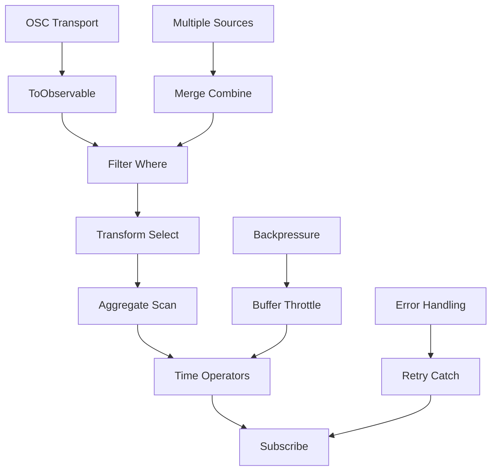

# eDrive.OSC.Reactive

[](https://www.nuget.org/packages/eDrive.OSC.Reactive/)
[](https://opensource.org/licenses/MIT)

Reactive Extensions (Rx.NET) integration for eDrive.OSC, enabling powerful event-driven and asynchronous OSC programming patterns. Transform OSC streams into reactive observables for complex event processing, filtering, and composition.

## 🎯 Features

- **Observable OSC Streams** - Convert any OSC transport into reactive observables
- **Advanced Filtering** - Filter OSC messages by address patterns, argument types, and values
- **Stream Composition** - Combine multiple OSC sources with powerful operators
- **Backpressure Handling** - Manage high-frequency OSC data with flow control
- **Error Resilience** - Robust error handling with retry and fallback strategies
- **Hot/Cold Observables** - Support for both immediate and deferred OSC streams
- **LINQ Integration** - Use familiar LINQ operators with OSC data

## 📦 Installation

```bash
dotnet add package eDrive.OSC.Reactive
```

**Dependencies**: Requires System.Reactive (Rx.NET) 6.0+

## 🚀 Quick Start

### Basic Observable Streams

```csharp
using eDrive.OSC;
using eDrive.OSC.Network.Upd;
using eDrive.OSC.Reactive;
using System.Reactive.Linq;

// Convert OSC stream to observable
using var receiver = new OscInboundUdpStream(9000);
var oscStream = receiver.ToObservable();

// Subscribe to all OSC messages
oscStream.Subscribe(packet => {
    if (packet is OscMessage msg)
        Console.WriteLine($"Received: {msg.Address}");
});

receiver.Start();
```

### Message Filtering

```csharp
// Filter by address pattern
var synthMessages = oscStream
    .OfType<OscMessage>()
    .Where(msg => msg.Address.StartsWith("/synth/"));

// Filter by specific addresses
var frequencyChanges = oscStream
    .OfType<OscMessage>()
    .Where(msg => msg.Address == "/synth/freq");

// Filter by argument types and values
var noteOnEvents = oscStream
    .OfType<OscMessage>()
    .Where(msg => msg.Address == "/midi/note")
    .Where(msg => msg.Arguments.Count >= 2)
    .Where(msg => (int)msg.Arguments[1] > 0); // Velocity > 0

// Complex filtering with multiple conditions
var importantEvents = oscStream
    .OfType<OscMessage>()
    .Where(msg => msg.Address.StartsWith("/important/") && 
                  msg.Arguments.Count > 0 &&
                  msg.Arguments[0] is float f && f > 0.5f);
```

## 🔄 Stream Transformation

### Mapping and Projection

```csharp
// Extract specific values
var frequencies = oscStream
    .OfType<OscMessage>()
    .Where(msg => msg.Address == "/synth/freq")
    .Select(msg => (float)msg.Arguments[0]);

// Transform messages
var normalizedValues = oscStream
    .OfType<OscMessage>()
    .Where(msg => msg.Address.StartsWith("/control/"))
    .Select(msg => new {
        Address = msg.Address,
        NormalizedValue = Math.Clamp((float)msg.Arguments[0], 0f, 1f)
    });

// Create new messages from input
var echoMessages = oscStream
    .OfType<OscMessage>()
    .Select(msg => new OscMessage("/echo" + msg.Address, msg.Arguments.ToArray()));
```

### Temporal Operations

```csharp
// Throttle high-frequency updates
var throttledUpdates = oscStream
    .OfType<OscMessage>()
    .Where(msg => msg.Address == "/mouse/position")
    .Throttle(TimeSpan.FromMilliseconds(50)); // Max 20Hz

// Sample at regular intervals
var sampledValues = oscStream
    .OfType<OscMessage>()
    .Where(msg => msg.Address == "/sensor/data")
    .Sample(TimeSpan.FromSeconds(1)); // Sample every second

// Buffer messages over time windows
var messageBuffers = oscStream
    .OfType<OscMessage>()
    .Buffer(TimeSpan.FromSeconds(5)); // Collect 5 seconds of messages

// Debounce rapid changes
var debouncedInputs = oscStream
    .OfType<OscMessage>()
    .Where(msg => msg.Address == "/ui/input")
    .DebounceBuffer(TimeSpan.FromMilliseconds(300));
```

### Aggregation and Grouping

```csharp
// Group by address prefix
var groupedByModule = oscStream
    .OfType<OscMessage>()
    .GroupBy(msg => msg.Address.Split('/')[1]) // Group by first path segment
    .SelectMany(group => 
        group.Select(msg => new { Module = group.Key, Message = msg }));

// Calculate running averages
var runningAverages = oscStream
    .OfType<OscMessage>()
    .Where(msg => msg.Address == "/sensor/temperature")
    .Select(msg => (float)msg.Arguments[0])
    .Scan((acc, value) => (acc + value) / 2); // Simple running average

// Windowed statistics
var statistics = oscStream
    .OfType<OscMessage>()
    .Where(msg => msg.Address == "/performance/metric")
    .Select(msg => (float)msg.Arguments[0])
    .Buffer(100) // Last 100 values
    .Select(values => new {
        Count = values.Count,
        Average = values.Average(),
        Min = values.Min(),
        Max = values.Max()
    });
```

## 🔀 Stream Composition

### Combining Multiple Sources

```csharp
// Merge multiple OSC sources
using var udpReceiver = new OscInboundUdpStream(9000);
using var tcpReceiver = new OscInboundTcpStream(9001);

var combinedStream = Observable.Merge(
    udpReceiver.ToObservable(),
    tcpReceiver.ToObservable()
);

// Combine with timestamps
var timestampedStream = combinedStream
    .Timestamp()
    .Select(stamped => new {
        Packet = stamped.Value,
        ReceivedAt = stamped.Timestamp
    });
```

### Cross-Stream Operations

```csharp
// Correlate messages from different streams
var controlStream = oscStream
    .OfType<OscMessage>()
    .Where(msg => msg.Address.StartsWith("/control/"));

var statusStream = oscStream
    .OfType<OscMessage>()
    .Where(msg => msg.Address.StartsWith("/status/"));

var correlatedEvents = controlStream
    .Join(statusStream,
        _ => Observable.Timer(TimeSpan.FromSeconds(1)), // Control window
        _ => Observable.Timer(TimeSpan.FromSeconds(1)), // Status window
        (control, status) => new { Control = control, Status = status });

// Trigger actions based on combinations
var triggerConditions = Observable.CombineLatest(
    oscStream.OfType<OscMessage>().Where(m => m.Address == "/trigger/a"),
    oscStream.OfType<OscMessage>().Where(m => m.Address == "/trigger/b"),
    (a, b) => new { TriggerA = a, TriggerB = b })
    .Where(combined => 
        (bool)combined.TriggerA.Arguments[0] && 
        (bool)combined.TriggerB.Arguments[0]);
```

## 🎛️ Advanced Patterns

### State Machine Implementation

```csharp
public enum SynthState { Off, Attack, Sustain, Release }

var stateChanges = oscStream
    .OfType<OscMessage>()
    .Where(msg => msg.Address == "/synth/gate")
    .Select(msg => (bool)msg.Arguments[0])
    .Scan(SynthState.Off, (state, gate) => state switch {
        SynthState.Off when gate => SynthState.Attack,
        SynthState.Attack when gate => SynthState.Sustain,
        SynthState.Sustain when !gate => SynthState.Release,
        SynthState.Release when !gate => SynthState.Off,
        _ => state
    })
    .DistinctUntilChanged();

stateChanges.Subscribe(state => Console.WriteLine($"Synth state: {state}"));
```

### Event Sourcing Pattern

```csharp
public class OscEventStore
{
    private readonly Subject<OscEvent> _events = new();
    
    public IObservable<OscEvent> Events => _events.AsObservable();
    
    public void RecordEvent(OscMessage message)
    {
        var oscEvent = new OscEvent
        {
            Id = Guid.NewGuid(),
            Timestamp = DateTimeOffset.UtcNow,
            Address = message.Address,
            Arguments = message.Arguments.ToArray()
        };
        
        _events.OnNext(oscEvent);
    }
    
    // Replay events from a specific point in time
    public IObservable<OscEvent> ReplayFrom(DateTimeOffset fromTime)
    {
        return _events.Where(e => e.Timestamp >= fromTime);
    }
}

public class OscEvent
{
    public Guid Id { get; set; }
    public DateTimeOffset Timestamp { get; set; }
    public string Address { get; set; }
    public object[] Arguments { get; set; }
}
```

### Complex Event Processing (CEP)

```csharp
// Detect patterns in OSC messages
var patternDetector = oscStream
    .OfType<OscMessage>()
    .Where(msg => msg.Address.StartsWith("/gesture/"))
    .Buffer(TimeSpan.FromSeconds(2), TimeSpan.FromMilliseconds(100)) // Sliding window
    .Where(buffer => buffer.Count >= 3) // Minimum 3 messages
    .Select(DetectGesture)
    .Where(gesture => gesture != GestureType.None);

private GestureType DetectGesture(IList<OscMessage> messages)
{
    // Implement gesture recognition logic
    var positions = messages
        .Where(m => m.Address == "/gesture/position")
        .Select(m => new { X = (float)m.Arguments[0], Y = (float)m.Arguments[1] })
        .ToList();
        
    if (IsSwipeLeft(positions)) return GestureType.SwipeLeft;
    if (IsSwipeRight(positions)) return GestureType.SwipeRight;
    
    return GestureType.None;
}
```

## ⚡ Performance Optimization

### Backpressure Management

```csharp
// Handle high-frequency OSC data
var managedStream = oscStream
    .ObserveOn(TaskPoolScheduler.Default) // Move to background thread
    .OnBackpressureBuffer(1000) // Buffer up to 1000 messages
    .OnBackpressureDrop() // Drop oldest when buffer full
    .Retry(3) // Retry on errors
    .Catch<OscPacket, Exception>(ex => {
        Console.WriteLine($"Stream error: {ex.Message}");
        return Observable.Empty<OscPacket>(); // Continue with empty stream
    });
```

### Resource Management

```csharp
public class OptimizedOscProcessor : IDisposable
{
    private readonly CompositeDisposable _disposables = new();
    private readonly Subject<OscMessage> _processedMessages = new();
    
    public IObservable<OscMessage> ProcessedMessages => _processedMessages.AsObservable();
    
    public OptimizedOscProcessor(IOscInboundStream stream)
    {
        // Setup processing pipeline with proper disposal
        stream.ToObservable()
            .OfType<OscMessage>()
            .ObserveOn(NewThreadScheduler.Default)
            .Subscribe(
                onNext: ProcessMessage,
                onError: HandleError,
                onCompleted: () => Console.WriteLine("Stream completed"))
            .DisposeWith(_disposables);
    }
    
    private void ProcessMessage(OscMessage message)
    {
        // Process message efficiently
        _processedMessages.OnNext(message);
    }
    
    private void HandleError(Exception error)
    {
        Console.WriteLine($"Processing error: {error.Message}");
    }
    
    public void Dispose()
    {
        _disposables.Dispose();
        _processedMessages.Dispose();
    }
}
```

## 🧪 Testing Reactive OSC Code

### Unit Testing Observables

```csharp
[Test]
public void OscStream_FiltersByAddress_ReturnsMatchingMessages()
{
    // Arrange
    var testScheduler = new TestScheduler();
    var messages = new[]
    {
        OnNext(100, new OscMessage("/synth/freq", 440f)),
        OnNext(200, new OscMessage("/drum/hit", 1)),
        OnNext(300, new OscMessage("/synth/amp", 0.8f))
    };
    
    var sourceStream = testScheduler.CreateHotObservable(messages);
    
    // Act
    var filteredStream = sourceStream
        .Where(msg => msg.Address.StartsWith("/synth/"));
    
    var observer = testScheduler.CreateObserver<OscMessage>();
    filteredStream.Subscribe(observer);
    
    testScheduler.Start();
    
    // Assert
    Assert.AreEqual(2, observer.Messages.Count);
    Assert.AreEqual("/synth/freq", observer.Messages[0].Value.Value.Address);
    Assert.AreEqual("/synth/amp", observer.Messages[1].Value.Value.Address);
}
```

### Integration Testing

```csharp
[Test]
public async Task ReactiveOscPipeline_ProcessesRealTimeData()
{
    var receivedMessages = new List<OscMessage>();
    var completionSource = new TaskCompletionSource<bool>();
    
    using var sender = new OscOutboundUdpStream("127.0.0.1", 9000);
    using var receiver = new OscInboundUdpStream(9000);
    
    // Setup reactive pipeline
    receiver.ToObservable()
        .OfType<OscMessage>()
        .Take(5) // Take first 5 messages
        .Subscribe(
            msg => receivedMessages.Add(msg),
            ex => completionSource.SetException(ex),
            () => completionSource.SetResult(true));
    
    receiver.Start();
    
    // Send test messages
    for (int i = 0; i < 5; i++)
    {
        await sender.SendAsync(new OscMessage($"/test/{i}", i));
        await Task.Delay(10);
    }
    
    // Wait for completion
    await completionSource.Task.TimeoutAfter(TimeSpan.FromSeconds(5));
    
    Assert.AreEqual(5, receivedMessages.Count);
}
```

## 🔄 Observable Flow Diagram



## 🎯 Use Cases

### Real-Time Audio Processing

```csharp
// Process audio control messages
var audioProcessor = oscStream
    .OfType<OscMessage>()
    .Where(msg => msg.Address.StartsWith("/audio/"))
    .GroupBy(msg => msg.Address.Split('/')[2]) // Group by channel
    .SelectMany(channel => 
        channel.Throttle(TimeSpan.FromMilliseconds(10)) // Limit to 100Hz per channel
               .Select(msg => ProcessAudioCommand(channel.Key, msg)));
```

### Live Performance Control

```csharp
// Coordinate multiple performers
var performanceController = Observable.Merge(
        oscStream.Where(IsPerformerA),
        oscStream.Where(IsPerformerB),
        oscStream.Where(IsConductor))
    .Timestamp()
    .Buffer(TimeSpan.FromMilliseconds(50)) // 20Hz coordination
    .Select(CoordinatePerformance)
    .Where(coordination => coordination.HasChanges);
```

### Interactive Installations

```csharp
// Respond to visitor interactions
var interactionEngine = oscStream
    .OfType<OscMessage>()
    .Where(msg => msg.Address.StartsWith("/sensor/"))
    .GroupBy(msg => ExtractZone(msg.Address))
    .SelectMany(zone => zone
        .Throttle(TimeSpan.FromMilliseconds(100))
        .Select(msg => CreateInteractiveResponse(zone.Key, msg)));
```

## 🔗 Integration with Other Libraries

### SignalR Integration

```csharp
public class OscSignalRHub : Hub
{
    public async Task StreamOscData(CancellationToken cancellationToken)
    {
        var oscStream = _oscReceiver.ToObservable()
            .OfType<OscMessage>()
            .Select(msg => new { msg.Address, msg.Arguments });
            
        await foreach (var message in oscStream.ToAsyncEnumerable().WithCancellation(cancellationToken))
        {
            await Clients.All.SendAsync("OscMessage", message, cancellationToken);
        }
    }
}
```

### Machine Learning Integration

```csharp
// Collect training data from OSC streams
var trainingData = oscStream
    .OfType<OscMessage>()
    .Where(msg => msg.Address == "/ml/input")
    .Buffer(1000) // Collect batches of 1000 samples
    .Select(batch => batch.Select(ExtractFeatures).ToArray());

trainingData.Subscribe(async features => {
    await _mlModel.TrainAsync(features);
});
```

## 🔗 Related Packages

- [**eDrive.OSC**](../eDrive.OSC/README.md) - Core OSC implementation
- [**eDrive.OSC.Interfaces**](../eDrive.OSC.Interfaces/README.md) - Stream interfaces
- [**eDrive.OSC.Network**](../eDrive.OSC.Network/README.md) - Network transport implementations
- [**eDrive.OSC.Network.NamedPipes**](../eDrive.OSC.Network.NamedPipes/README.md) - Windows Named Pipes transport

## 📚 Further Reading

- [Reactive Extensions Documentation](https://docs.microsoft.com/en-us/previous-versions/dotnet/reactive-extensions/)
- [OSC 1.1 Specification](http://opensoundcontrol.stanford.edu/spec-1_1.html)
- [Rx.NET GitHub Repository](https://github.com/dotnet/reactive)

---

**eDrive.OSC.Reactive** - Reactive programming for OSC applications