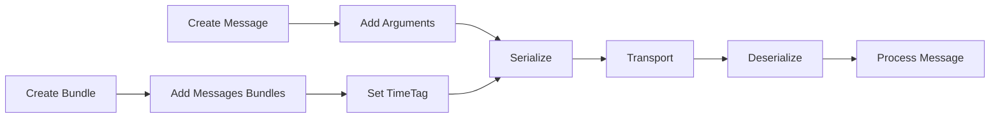

# eDrive.OSC - Core Library

[](https://www.nuget.org/packages/eDrive.OSC/)
[](https://opensource.org/licenses/MIT)

The core eDrive.OSC library provides a complete implementation of the Open Sound Control (OSC) 1.1 specification for .NET, featuring both binary and JSON serialization capabilities.

## 🚀 Features

- **Full OSC 1.1 compliance** with all standard types
- **Dual serialization**: Binary OSC protocol and JSON
- **OSC Messages** with type-safe argument handling
- **OSC Bundles** with precise timing support
- **Custom type serializers** for extensibility
- **Thread-safe** operations
- **High performance** with minimal allocations
- **Comprehensive edge case handling** (NaN, Infinity, large data)

## 📦 Installation

```bash
dotnet add package eDrive.OSC
```

## 🏗️ Core Components

### OSC Messages

Create and manipulate OSC messages with various argument types:

```csharp
using eDrive.OSC;

// Create a message with multiple arguments
var message = new OscMessage("/synth/note", 60, 0.8f, "C4", true);

// Access message properties
Console.WriteLine($"Address: {message.Address}");
Console.WriteLine($"Arguments: {message.Arguments.Count}");

// Type-safe argument access
int note = (int)message.Arguments[0];
float velocity = (float)message.Arguments[1];
string noteName = (string)message.Arguments[2];
bool gate = (bool)message.Arguments[3];

// Serialize to binary
byte[] bytes = message.ToByteArray();

// Deserialize from binary
var restored = OscPacket.Parse(bytes) as OscMessage;
```

### OSC Bundles

Group multiple messages with precise timing:

```csharp
// Create a bundle for immediate execution
var bundle = new OscBundle(OscTimeTag.Now);

// Add messages to the bundle
bundle.Add(new OscMessage("/synth/freq", 440.0f));
bundle.Add(new OscMessage("/synth/amp", 0.8f));
bundle.Add(new OscMessage("/synth/gate", true));

// Create timed bundle (execute in 1 second)
var timedBundle = new OscBundle(OscTimeTag.FromTimeSpan(TimeSpan.FromSeconds(1)));
timedBundle.Add(new OscMessage("/synth/gate", false));

// Nested bundles are supported
var masterBundle = new OscBundle(OscTimeTag.Now);
masterBundle.Add(bundle);
masterBundle.Add(timedBundle);

// Serialize bundle
byte[] bundleBytes = masterBundle.ToByteArray();
```

### JSON Serialization

Convert OSC packets to/from JSON for web applications:

```csharp
// Message to JSON
var message = new OscMessage("/test", 42, "hello", 3.14f);
string json = message.ToJson();
/* Output:
{
  "Address": "/test",
  "Arguments": [
    { "Type": "i", "Value": 42 },
    { "Type": "s", "Value": "hello" },
    { "Type": "f", "Value": 3.14 }
  ]
}
*/

// JSON to message
var restored = OscPacket.FromJson(json) as OscMessage;

// Bundle to JSON
var bundle = new OscBundle(OscTimeTag.Now);
bundle.Add(message);
string bundleJson = bundle.ToJson();

// JSON to bundle
var restoredBundle = OscPacket.FromJson(bundleJson) as OscBundle;
```

## 🎯 Supported Types

| .NET Type | OSC Tag | Description | Example |
|-----------|---------|-------------|---------|
| `int` | `i` | 32-bit integer | `42` |
| `float` | `f` | 32-bit float | `3.14f` |
| `string` | `s` | UTF-8 string | `"hello"` |
| `byte[]` | `b` | Binary blob | `new byte[] {1,2,3}` |
| `long` | `h` | 64-bit integer | `123456789L` |
| `double` | `d` | 64-bit float | `3.141592653589793` |
| `OscTimeTag` | `t` | Time tag | `OscTimeTag.Now` |
| `char` | `c` | ASCII character | `'A'` |
| `OscColour` | `r` | RGBA color | `new OscColour(255,128,64,255)` |
| `OscMidiMessage` | `m` | MIDI message | `new OscMidiMessage(0,144,60,127)` |
| `OscSymbol` | `S` | Symbol/atom | `new OscSymbol("symbol")` |
| `bool` (true) | `T` | Boolean true | `true` |
| `bool` (false) | `F` | Boolean false | `false` |
| `null` | `N` | Nil/null | `null` |
| Special | `I` | Infinitum | `float.PositiveInfinity` |

## 🔧 Advanced Features

### Custom Serializers

Extend support for custom types:

```csharp
[CustomOscSerialiser(typeof(MyCustomType), 'X')]
public class MyCustomSerialiser : OscTypeSerialiser<MyCustomType>
{
    public override object ReadFrom(BinaryReader input)
    {
        // Custom deserialization logic
        return new MyCustomType(input.ReadString());
    }

    public override void WriteTo(BinaryWriter output, object value)
    {
        // Custom serialization logic
        var custom = (MyCustomType)value;
        output.Write(custom.Value);
    }
}

// Register the serializer
[ContainsOscSerialisers]
public class MySerializers { }
```

### Time Tags

Work with precise OSC timing:

```csharp
// Immediate execution
var now = OscTimeTag.Now;

// Future execution
var future = OscTimeTag.FromDateTime(DateTime.UtcNow.AddSeconds(5));
var fromTimeSpan = OscTimeTag.FromTimeSpan(TimeSpan.FromMilliseconds(500));

// Time tag arithmetic
var earlier = now - TimeSpan.FromSeconds(1);
var later = now + TimeSpan.FromSeconds(1);

// Check if time has passed
if (timeTag.HasElapsed)
{
    Console.WriteLine("Time to execute!");
}
```

### Color and MIDI Support

```csharp
// OSC Color (RGBA)
var color = new OscColour(255, 128, 64, 255); // Red, Green, Blue, Alpha
var message1 = new OscMessage("/light/color", color);

// MIDI Message
var midiNote = new OscMidiMessage(
    port: 0,
    status: 144,  // Note On
    data1: 60,    // Middle C
    data2: 127    // Velocity
);
var message2 = new OscMessage("/midi/note", midiNote);
```

### Edge Case Handling

The library handles special floating-point values:

```csharp
// NaN and Infinity support
var message = new OscMessage("/special", 
    float.NaN, 
    float.PositiveInfinity, 
    float.NegativeInfinity,
    double.NaN);

// Large data sets
var largeBlob = new byte[1024 * 1024]; // 1MB blob
var blobMessage = new OscMessage("/data", largeBlob);

// Unicode strings
var unicodeMessage = new OscMessage("/text", "Hello 世界 🎵");
```

## 🔄 Message Flow



## 📊 Performance Considerations

- **Memory efficient**: Minimal allocations during serialization
- **Thread-safe**: All operations are safe for concurrent use
- **Streaming support**: Large messages handled efficiently
- **Pooled buffers**: Reduced GC pressure in high-throughput scenarios

## 🧪 Validation & Testing

The library includes comprehensive validation:

```csharp
// Address pattern validation
bool isValid = OscMessage.IsValidAddress("/synth/freq"); // true
bool isInvalid = OscMessage.IsValidAddress("invalid"); // false

// Argument type checking
var message = new OscMessage("/test");
message.Arguments.Add(42);        // int
message.Arguments.Add(3.14f);     // float
message.Arguments.Add("hello");   // string

// Type safety at runtime
foreach (var arg in message.Arguments)
{
    Console.WriteLine($"Type: {arg.GetType().Name}, Value: {arg}");
}
```

## 🔗 Integration

This core library integrates with:

- [**eDrive.OSC.Network**](../eDrive.OSC.Network/README.md) - Network transport layers
- [**eDrive.OSC.Network.NamedPipes**](../eDrive.OSC.Network.NamedPipes/README.md) - Named pipes transport
- [**eDrive.OSC.Reactive**](../eDrive.OSC.Reactive/README.md) - Reactive Extensions support

## 📚 Examples

See the [examples directory](../examples/) for complete sample applications demonstrating:

- Basic message sending/receiving
- Bundle creation and timing
- Custom type serialization
- JSON integration with web applications
- High-performance scenarios

---

**eDrive.OSC** - The foundation for OSC communication in .NET